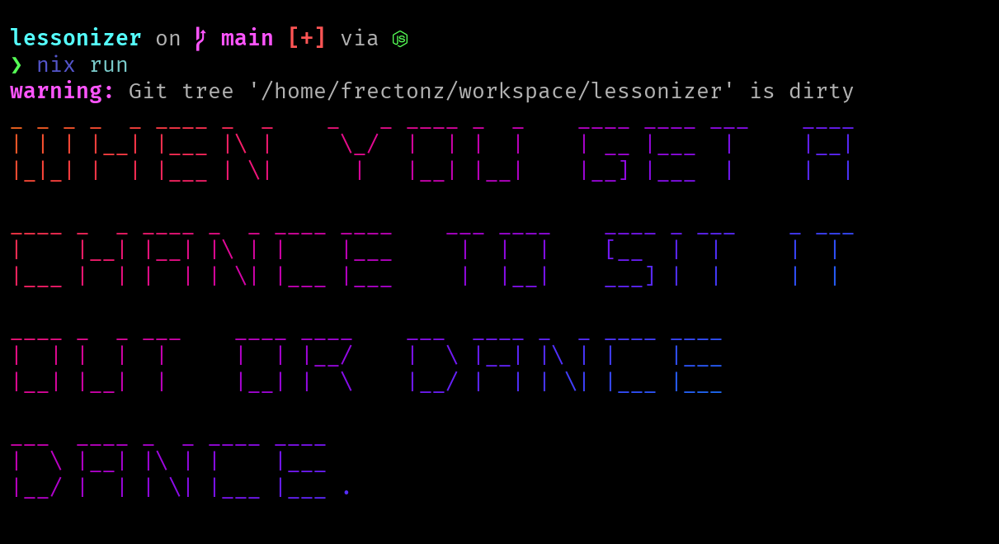

# Lessonalyzer

The [solar opposite's lessonalyzer](https://youtu.be/ucf81uiwf58) built with Bun + Nix.
It uses Bun's newly announced [Bun Shell](https://bun.sh/blog/the-bun-shell).
It uses [figlet](http://www.figlet.org/) for making the ASCII art texts and [lolcat](https://github.com/busyloop/lolcat) for coloring them.

The lessons were taken from the [official lessonalyzer website](https://www.thesolaropposites.com/lessonalyzer/).

